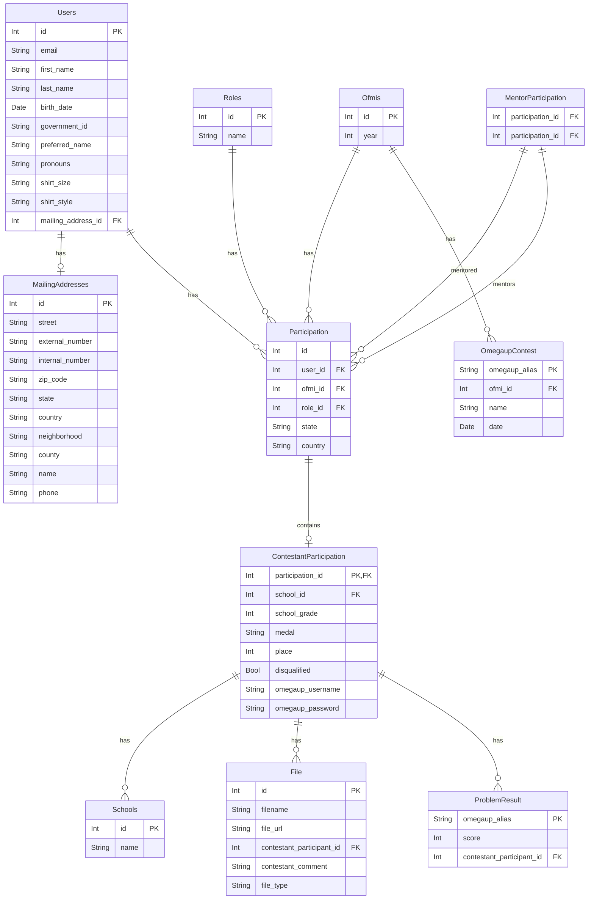

# Next-Prisma-Starter

Next-Prisma-Starter is a boilerplate project designed to help you quickly set up a well-organized development environment for building web applications using Next.js, Prisma, Redux Toolkit, RTK Query, and Tailwind CSS for styling. This starter template provides a solid foundation for your projects, making it easier to get started with popular technologies and best practices.

## Tech Stack

* **Next.js**: A popular React framework for building server-rendered and statically generated applications.
* **Prisma**: A modern database toolkit for Node.js and TypeScript, making database access and management more efficient and developer-friendly.
* **Redux Toolkit**: A library that simplifies state management in React applications, enabling you to write scalable and maintainable code.
* **RTK Query**: A powerful data-fetching library that simplifies fetching, caching, and updating data in your React components.
* **Tailwind CSS**: A utility-first CSS framework for rapidly building custom user interfaces with minimal CSS code.

## Getting Started

To get started with Next-Prisma-Starter, follow these steps:

1. Run the app and postgres locally. In the root of the project run:

```bash
docker compose up
```

## Database Management

### Database Schema

The current database schema is represented in the following diagram:



### Database Schema Updates

**Important:** When making any modifications to the Prisma schema (`schema.prisma`), please ensure that you also update the database diagram in this README to reflect the changes. This will help maintain consistent and up-to-date documentation for all developers working on the project.

To update the schema diagram:
1. Make your changes to the Prisma schema
2. Update the Mermaid diagram code in this README
3. Verify that the diagram renders correctly in the README preview
4. Include both the schema changes and README updates in the same commit

For more information about Mermaid diagrams, visit [Mermaid's documentation](https://mermaid-js.github.io/mermaid/#/).

### Database Operations

1. **Run Migrations**: If needed, apply database migrations to create the database schema.

```bash
docker compose exec app npm run migrate:dev
```

For an existing schema you can update it without creating a migration folder with following command:

```bash
docker compose exec app npm run push
```

2. **Seed Database**: To seed your database with dummy data.

```bash
docker compose exec app npm run prisma:seed
```

### Database Visualization

To see the database in a visual interface, you can open the Prisma Studio at http://localhost:5555 in your browser.

## Application Access

1. **Open Your App**: Your application should now be running at http://localhost:3000. You can start building your project by modifying the source code located in the `src` directory.

## Testing

To run the tests: Run the app and execute the following command in another terminal

```bash
docker compose exec app npm run test
```

## Folder Structure

Next-Prisma-Starter follows a well-organized folder structure to keep your codebase clean and maintainable. Here's a brief overview:

* `src`: Contains the application's source code, including pages, components, Redux Toolkit setup, and React Query API endpoints.
* `prisma`: Contains Prisma-related files, including the database schema (`schema.prisma`) and migrations.
* `public`: Public assets such as images and fonts can be placed in this directory.
* `styles`: Styling files, including Tailwind CSS configurations and global styles.
* `pages`: Next.js pages for routing and rendering components.
* `api`: Custom API routes for server-side logic.

```
next-prisma-starter/
├── prisma/
├── public/
├── src/
│   ├── config/
│   ├── pages/
│   ├── redux/
│   │   ├── api/
│   │   ├── features/
│   ├── styles/
│   ├── types/
│   └── utils/
├── ...
├── package.json
├── tsconfig.json
├── ...
```

## Development Guidelines

Before creating a commit make sure you run:

```bash
docker compose exec app npm run format
```

### Code Quality

#### StandardJS
- Install the StandardJS extension in your code editor.
- Activate Auto Fix On Save in the VSCode settings.

## Documentation

For more detailed documentation on how to use Next-Prisma-Starter and its features, refer to the Wiki.

## License

This project is licensed under the MIT License. Feel free to use, modify, and distribute it as needed for your projects. Please refer to the LICENSE file for more information.

## Contributions

Contributions are welcome! If you have suggestions, bug reports, or want to contribute to this project, please open an issue or create a pull request.

Happy coding with Next-Prisma-Starter! 🚀
