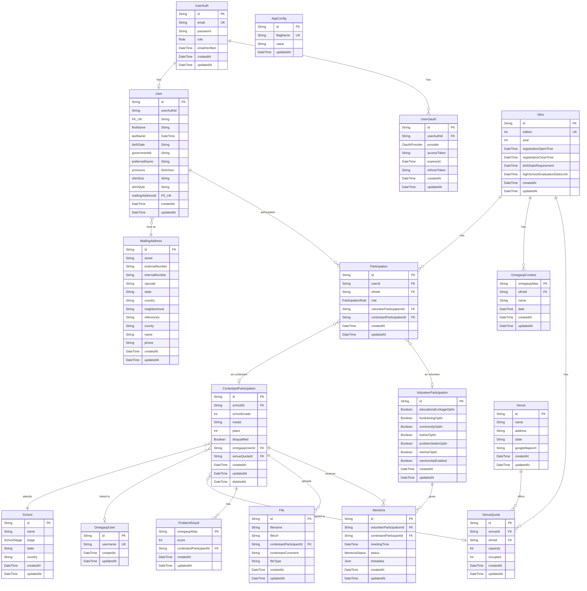

# OFMI Website

Website for the **Olimpiada Femenil Mexicana de Informatica (OFMI)** — Mexico's female informatics olympiad. This application manages contestant registration, venue assignment, mentorship scheduling, volunteer coordination, and admin operations for each yearly edition of the competition.

## Tech Stack

- **Next.js**: A popular React framework for building server-rendered and statically generated applications.
- **Prisma**: A modern database toolkit for Node.js and TypeScript, making database access and management more efficient and developer-friendly.
- **Redux Toolkit**: A library that simplifies state management in React applications, enabling you to write scalable and maintainable code.
- **RTK Query**: A powerful data-fetching library that simplifies fetching, caching, and updating data in your React components.
- **Tailwind CSS**: A utility-first CSS framework for rapidly building custom user interfaces with minimal CSS code.

## Getting Started

1. Run the app and postgres locally. In the root of the project run:

```bash
docker compose up
```

This is the current DB design


```mermaid
erDiagram
    UserAuth {
        String id PK
        String email UK
        String password
        Role role
        DateTime emailVerified
        DateTime createdAt
        DateTime updatedAt
    }

    UserOauth {
        String id PK
        String userAuthId FK
        OauthProvider provider
        String accessToken
        DateTime expiresAt
        String refreshToken
        DateTime createdAt
        DateTime updatedAt
    }

    User {
        String id PK
        String userAuthId FK_UK
        String firstName
        String lastName
        DateTime birthDate
        String governmentId
        String preferredName
        String pronouns
        ShirtSize shirtSize
        String shirtStyle
        String mailingAddressId FK_UK
        DateTime createdAt
        DateTime updatedAt
    }

    MailingAddress {
        String id PK
        String street
        String externalNumber
        String internalNumber
        String zipcode
        String state
        String country
        String neighborhood
        String references
        String county
        String name
        String phone
        DateTime createdAt
        DateTime updatedAt
    }

    Ofmi {
        String id PK
        Int edition UK
        Int year
        DateTime registrationOpenTime
        DateTime registrationCloseTime
        DateTime birthDateRequirement
        DateTime highSchoolGraduationDateLimit
        DateTime createdAt
        DateTime updatedAt
    }

    Participation {
        String id PK
        String userId FK
        String ofmiId FK
        ParticipationRole role
        String volunteerParticipationId FK
        String contestantParticipationId FK
        DateTime createdAt
        DateTime updatedAt
    }

    ContestantParticipation {
        String id PK
        String schoolId FK
        Int schoolGrade
        String medal
        Int place
        Boolean disqualified
        String omegaupUserId FK
        String venueQuotaId FK
        DateTime createdAt
        DateTime updatedAt
        DateTime deletedAt
    }

    VolunteerParticipation {
        String id PK
        Boolean educationalLinkageOptIn
        Boolean fundraisingOptIn
        Boolean communityOptIn
        Boolean trainerOptIn
        Boolean problemSetterOptIn
        Boolean mentorOptIn
        Boolean mentorshipEnabled
        DateTime createdAt
        DateTime updatedAt
    }

    School {
        String id PK
        String name
        SchoolStage stage
        String state
        String country
        DateTime createdAt
        DateTime updatedAt
    }

    Mentoria {
        String id PK
        String volunteerParticipationId FK
        String contestantParticipantId FK
        DateTime meetingTime
        MentoriaStatus status
        Json metadata
        DateTime createdAt
        DateTime updatedAt
    }

    ProblemResult {
        String omegaupAlias PK
        Int score
        String contestantParticipantId FK
        DateTime createdAt
        DateTime updatedAt
    }

    File {
        String id PK
        String filename
        String fileUrl
        String contestantParticipantId FK
        String contestantComment
        String fileType
        DateTime createdAt
        DateTime updatedAt
    }

    OmegaupContest {
        String omegaupAlias PK
        String ofmiId FK
        String name
        DateTime date
        DateTime createdAt
        DateTime updatedAt
    }

    OmegaupUser {
        String id PK
        String username UK
        DateTime createdAt
        DateTime updatedAt
    }

    Venue {
        String id PK
        String name
        String address
        String state
        String googleMapsUrl
        DateTime createdAt
        DateTime updatedAt
    }

    VenueQuota {
        String id PK
        String venueId FK
        String ofmiId FK
        Int capacity
        Int occupied
        DateTime createdAt
        DateTime updatedAt
    }

    AppConfig {
        String id PK
        String flagName UK
        String value
        DateTime updatedAt
    }

    UserAuth ||--o| User : "has"
    UserAuth ||--o{ UserOauth : "has"
    User }o--|| MailingAddress : "lives at"
    User ||--o{ Participation : "participates"
    Ofmi ||--o{ Participation : "has"
    Participation }o--o| ContestantParticipation : "as contestant"
    Participation }o--o| VolunteerParticipation : "as volunteer"
    ContestantParticipation }o--|| School : "attends"
    ContestantParticipation }o--o| OmegaupUser : "linked to"
    ContestantParticipation }o--o| VenueQuota : "assigned to"
    ContestantParticipation ||--o{ ProblemResult : "has"
    ContestantParticipation ||--o{ File : "uploads"
    ContestantParticipation ||--o{ Mentoria : "receives"
    VolunteerParticipation ||--o{ Mentoria : "gives"
    Ofmi ||--o{ OmegaupContest : "has"
    Ofmi ||--o{ VenueQuota : "has"
    Venue ||--o{ VenueQuota : "offers"
```

2. **Run Migrations**: If needed, apply database migrations to create the database schema.

   ```bash
   docker compose exec app npm run migrate:dev
   ```

   For an existing schema you can update it without creating a migration folder with following command:

   ```bash
   docker compose exec app npm run push
   ```

3. **Seed Database**: To seed your database with dummy data.

   ```bash
   docker compose exec app npm run prisma:seed
   ```

In production, migrations run automatically as part of the `deploy` script (`prisma migrate deploy`).

To see db you can open [http://localhost:5555](http://localhost:5555) in your browser

4. **Open Your App**: Your application should now be running at [http://localhost:3000](http://localhost:3000). You can start building your project by modifying the source code located in the `src` directory.

## App Configuration (Feature Flags)

The app uses an `AppConfig` table to store feature flags that control runtime behavior. Flags are key-value pairs stored in the database and cached for 12 hours.

### Available flags

| Flag name               | Type    | Effect                                                                |
| ----------------------- | ------- | --------------------------------------------------------------------- |
| `UPDATE_VENUE_DISABLED` | boolean | When `"true"`, blocks contestants from updating their venue selection |

### How it works

- Flags are fetched via `GET /api/appConfig/<flagName>` (add `?type=boolean` for boolean flags).
- Boolean flags default to `false` when the flag doesn't exist in the database.
- Values are cached in-memory for 12 hours after first read.

### Managing flags

To create or update a flag, use Prisma Studio at [http://localhost:5555](http://localhost:5555) or run:

```bash
docker compose exec app npx prisma db seed
# Or directly via psql:
docker compose exec db psql -U ofmi -d ofmi -c \
  "INSERT INTO \"AppConfig\" (id, \"flagName\", value, \"updatedAt\") VALUES (gen_random_uuid(), 'UPDATE_VENUE_DISABLED', 'true', now()) ON CONFLICT (\"flagName\") DO UPDATE SET value = 'true', \"updatedAt\" = now();"
```

## Testing

To run the tests: Run the app and execute the following command in another terminal

```
docker compose exec app npm run test
```

## Contributions

Contributions are welcome! If you have suggestions, bug reports, or want to contribute to this project, please open an issue or create a pull request.

Before creating the commit make sure you run `docker compose exec app npm run format`.

Create a new branch and make a PR to main repository.

## Folder Structure

Next-Prisma-Starter follows a well-organized folder structure to keep your codebase clean and maintainable. Here's a brief overview:

- `src`: Contains the application's source code, including pages, components, Redux Toolkit setup, and React Query API endpoints.
- `prisma`: Contains Prisma-related files, including the database schema (`schema.prisma`) and migrations.
- `public`: Public assets such as images and fonts can be placed in this directory.
- `styles`: Styling files, including Tailwind CSS configurations and global styles.
- `pages`: Next.js pages for routing and rendering components.
- `api`: Custom API routes for server-side logic.

```bash
next-prisma-starter/
├── prisma/
├── public/
├── src/
│   ├── config/
│   ├── pages/
│   ├── redux/
│   │   ├── api/
│   │   ├── features/
│   ├── styles/
│   ├── types/
│   └── utils/
├── ...
├── package.json
├── tsconfig.json
├── ...

```

## License

This project is licensed under the MIT License. Feel free to use, modify, and distribute it as needed for your projects. Please refer to the [LICENSE](LICENSE) file for more information.

## StandardJS

Install the [StandardJS](https://marketplace.visualstudio.com/items?itemName=standard.vscode-standard) extension.

Activate Auto Fix On Save in the VSCode settings.
